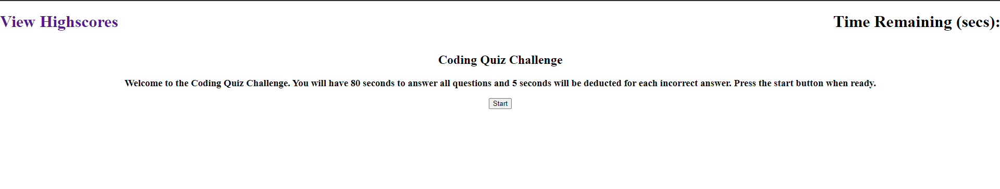
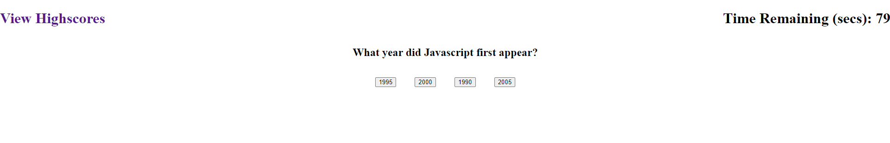
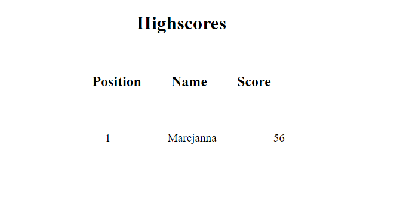

# Code Quiz - HW04

## Description

This Code Quiz required me to create the HTML, CSS, and JS files completely from scratch. I had to make use of arrays and local storage to store user scores and usernames. I also had to use if statements and data attributes to determine if the user selected the correct answer. If they did, they will move onto the next question. If not, 10 seconds will be deducted from the timer.

The user score is based on how much time they have remaining.

## Screenshots

Quiz starting page:

Quiz Question 1:

Highscores:

## Project Github Pages Link

[Deployed GitHub Pages Site](https://leon3005.github.io/Code_Quiz/)
